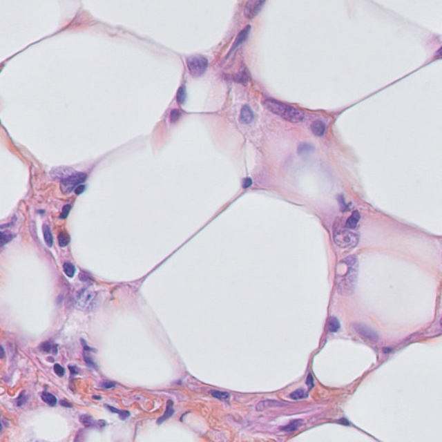

<h2>ImageMask-Dataset-Triple-Negative-Breast-Cancer (2024/06/14) </h2>
This is a simple TNBC (Triple Negative Breast Cancer) dataset  for Image-Segmentation. 
The original dataset used here has been taken from the following web site. 
<a href="https://zenodo.org/records/2579118"><b>Segmentation of Nuclei in Histopathology Images by deep regression of the distance map</b></a>
 

 
<b>Download TNBC-ImageMask-Datase</b> 
You can download our dataset from the google drive  
<a href="https://drive.google.com/file/d/1sR4BxykMBy0KkhmmUIx89yBAU-es-FSl/view?usp=sharing">TNBC-ImageMask-Dataset-V1.zip</a>
 

 
<b>Image and mask sample</b> 

<table>
<tr>
<th>
Image 
</th>
<th>
Mask
</th>
</tr>
<tr>
<td>

</td>
<td>

</td>
</tr>

<tr>
<td>

</td>
<td>

</td>
</tr>
</table>

<h3>1. Dataset Citation</h3>
The original dataset used here has been taken from the following web site. 
<a href="https://zenodo.org/records/2579118"><b>Segmentation of Nuclei in Histopathology Images by deep regression of the distance map</b></a>
 
Published February 16, 2018 | Version 1.1 

<b>Creators</b> 
Naylor Peter Jack,Walter Thomas, Laé Marick, Reyal Fabien 

<b>Description</b> 
This dataset has been annonced in our accepted paper "Segmentation of Nuclei in Histopathology Images  
by deep regression of the distance map" in Transcation on Medical Imaging on the 13th of August. 
This dataset consists of 50 annotated images, divided into 11 patients. 
 
 
v1.1 (27/02/19): Small corrections to a few pixel that were labelled nuclei but weren't. 
 

<h3>2. Download TNBC-Segmentation dataset </h3>
If you would like to create your own dataset by yourself,
please download the original <b>TNBC-Segmentation</b> dataset from the link
<a href="https://zenodo.org/records/2579118/files/TNBC_NucleiSegmentation.zip?download=1">TNBC-Segmentation.zip
</a>, and place the downloaded image and mask files under <b>TNBC_dataset</b> directory, 
<pre>
./TNBC_dataset
├─GT_01
├─GT_02
├─GT_03
├─GT_04
├─GT_05
├─GT_06
├─GT_07
├─GT_08
├─GT_09
├─GT_10
├─GT_11
├─Slide_01
├─Slide_02
├─Slide_03
├─Slide_04
├─Slide_05
├─Slide_06
├─Slide_07
├─Slide_08
├─Slide_09
├─Slide_10
└─Slide_11
</pre>

<h3>3. Generate master dataset </h3>
Please run the following commnad for Python script <a href="./ImageMaskDatasetGenerator.py">ImageMaskDatasetGenerator.py</a> to generate
images and masks jgp files: 
<pre>
>python ImageMaskDatasetGenerator.py 
</pre>
, by which the following images and masks datasets of 640x640 pixel-size will be created under <b>TNBC-master</b> directory,
by flipping, rotating, deforming and distorting image augmentation processings. 
<pre>
./TNBC-master
  ├─images
  └─masks
</pre>

<h3>4. Split master dataset </h3>
Please run the following command for Python script <a href="./split_master.py">split_master.py</a>.
<pre>
>python split_master.py
</pre>
, by wich test, train, and valid subdatasets will be created. 

<pre>
./TNBC-ImageMask-Dataset-V1
├─test
│  ├─images
│  └─masks
├─train
│  ├─images
│  └─masks
└─valid
    ├─images
    └─masks
</pre>

Train images sample 
 
Train masks sample 
 

Dataset Statistics  

 

